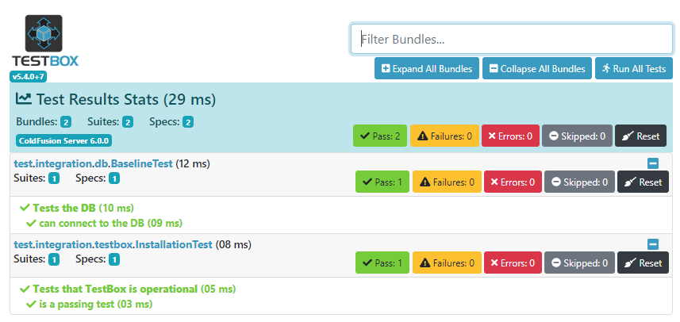

# A BoxLag container and a MariaDB container

This is just a pair of containers for testing BoxLang stuff.

Currently it's just the baseline install with a couple of integration tests
to test the install.

Installation:

- Clone the repo
```
git clone git@github.com:adamcameron/boxlang_and_mariadb.git
```

- Change into the `boxlang_and_mariadb/docker` directory:

```
cd boxlang_and_mariadb/docker
```

- Run the install shell script:

```
./rebuildContainers.sh
```

This just wraps up calls to `docker compose down|build|up` in sequence.


This installs the BoxLang web server on 8080, and MariaDB on 3306.
It also installs commandbox and the `bx-compat` and `bx-mysql` modules.

One can run the integration tests:

```
http://localhost:8080/test/runTests.cfm
```

One should get:


